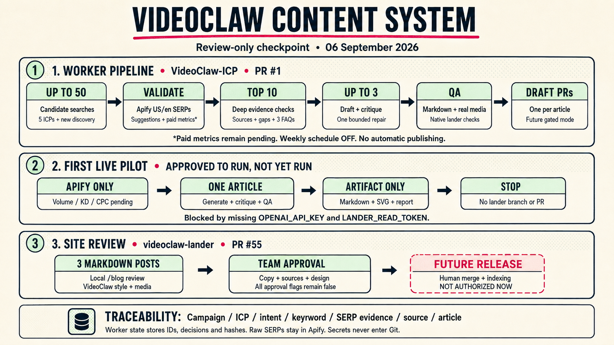

# VideoClaw SEO / AEO / GEO content system

Review-only checkpoint: **6 September 2026**. No production merge, deployment, publishing, indexing submission, or schedule activation is authorized in this work.



Read the three lanes independently, left to right. There are no return arrows or cross-lane connectors. The raster is the pre-pilot architecture illustration; its credential/status annotations are superseded by the live-pilot results below. The detailed conditions below are the source of truth.

## 1. Persistent worker: research and drafting

Implementation: [VideoClaw-ICP PR #1](https://github.com/frenzy2004/VideoClaw-ICP/pull/1), branch `automation/persistent-autoblogger-v1`, targeting `seo-campaign`.

```text
Up to 50 candidates → validation → top 10 deep checks → up to 3 drafts → native QA → draft PRs
```

The last step is a future gated mode, not permission to open generated lander PRs now.

| Stage | What happens | Retained evidence |
| --- | --- | --- |
| Candidates | Read the incremental backlog and discover related searches for five ICPs. Deduplicate IDs, slugs, titles, keywords and intent fingerprints against state and lander inventory. | Candidate identity, campaign, trigger and intent |
| Validation | Recheck US/en Google SERPs through Apify, record organic competitors and suggestion/PAA/related-query signals, and request keyword metrics from a configured provider. | Exact query, locale, actor run, dataset and observation time; metric provenance separately |
| Top 10 | Require two reachable sources including an authoritative source, three relevant PAA-grounded FAQs, a defensible competitor gap and product/ICP fit. | Source URLs, competitor gap, FAQ evidence and selection decision |
| Up to 3 drafts | Structured OpenAI drafting and independent critique, at most one repair followed by verification. Maximum two drafts from one ICP. | Markdown bundle, critique result and hashes |
| Native QA | Select allowlisted product media, generate a deterministic branded SVG and validate in a disposable lander checkout using its own contract, lint and build. | Media attribution and native QA report |
| Draft PRs, later | Only the post-merge, fully credentialed mode can open one draft PR per article. All approval flags remain false. | PR number, artifact hash and outcome |

The 250-opportunity backlog is an input, not a required count or proof of measured demand. Earlier research generated 1,000 candidate queries and retained 250 SERP-observed opportunities; do not describe that as 1,000 demand-validated keywords.

## 2. Current pilot: exactly one artifact, no lander write

```text
Apify evidence → one draft + critique + QA → Markdown / SVG / report artifact → STOP
```

- The user approved this one live pilot. **Live research ran; zero articles were generated.** Fifty candidates were scanned, and all ten deep checks failed: eight source-gate failures and two relevant-PAA failures. [Full pilot report](../autoblogger/LIVE-PILOT-2026-09-06.md).
- `KEYWORD_PROVIDER=pending` keeps volume, difficulty and CPC explicitly unknown. Paid metrics do not block this one pilot.
- `LANDER_BASE_REF=seo/founder-video-blog-launch` validates against the unmerged blog contract, not production.
- `APIFY_TOKEN` is present in ICP Actions secrets. `OPENAI_API_KEY` is now stored locally in an ignored environment file and verified against `gpt-5.5`; the scoped lander read token is still absent.
- The read token must be separate and fine-grained, restricted to lander contents:read and pull requests:read. Interactive GitHub access does not establish that the worker credential is installed.
- This local attempt used the existing checkout, fresh GET-only interactive GitHub inventory and ignored local state; no publication backend was supplied. It did not modify remote state or configure unattended Actions. The standard worker's prepared-artifact hash prevents consuming a second artifact after an uncertain failure; this attempt produced none.
- Offline fixtures exercise this path but are **not** live generated article evidence.

### Apify and DataForSEO are different inputs

Apify remains the research source. Its Google Search actor exposes organic results, related queries and People Also Ask; these describe the search landscape, not monthly search volume or a keyword-difficulty estimate. [Apify actor documentation](https://apify.com/apify/google-search-scraper)

DataForSEO is a possible later metrics integration, not a connected provider in this version. Its [Google Ads search-volume endpoint](https://docs.dataforseo.com/v3/keywords_data/google_ads/search_volume/live/) and [Labs keyword-difficulty endpoint](https://docs.dataforseo.com/v3/dataforseo_labs/google/bulk_keyword_difficulty/live/) are separate services. The current worker accepts `pending`, `semrush` and `ahrefs`; it does not accept `dataforseo` or turn an Apify token into DataForSEO credentials.

No new metrics adapter is claimed here. A third-party Apify actor would need verified upstream provenance, US scope, date, units and response validation before its metrics could be used. Until then the pilot stays pending and recurring/draft-PR mode remains blocked by the paid-metrics gate.

## 3. Site review and the human release boundary

Site integration: [videoclaw-lander PR #55](https://github.com/INFR-Organisation/videoclaw-lander/pull/55), branch `seo/founder-video-blog-launch`, targeting `main`. It remains open and unmerged.

```text
Three Markdown posts in local /blog review → team copy / source / design approval → future human release
```

The three distinct review topics are:

1. How to make a founder pitch video.
2. A 60-second founder pitch video script.
3. What to do when a live product demo fails.

They use the lander's Markdown renderer, VideoClaw typography and media, `/download` CTAs and per-article metadata. All three remain `status: review` with every approval flag false. Review pages are non-indexable in previews and unavailable in production. Local editorial improvements are not team publication approval.

Human approval, a future status/date change, merge, live-domain checks and search-engine submissions are separate release steps outside this authorization. The worker performs none of them.

## Traceability and state

Every article traces back to campaign, ICP, trigger, intent, keyword, SERP observation, competitor gap and cited sources. Provenance belongs in frontmatter and review reports, not public article prose.

| Location | Contents |
| --- | --- |
| `VideoClaw-ICP` source branch | Worker, research library, tests and diagrams |
| `autoblogger-state`, when Actions runs begin | Compact identities, decisions, run/dataset IDs, provider provenance, hashes, PR outcomes and bounded redacted failures; local pilot history must be reconciled first |
| Ignored local pilot state and reports | This live attempt's decisions, provenance, bounded retries and source/PAA rejection report; not Git-backed |
| Apify datasets | Raw search observations |
| Seven-day workflow artifacts | Proposed Markdown, SVG, validated bundle and QA report |
| `videoclaw-lander` review branch | Three manually reviewed drafts and blog renderer |
| Runtime secrets only | Apify, OpenAI and scoped GitHub/provider credentials; never Git content |

## What is ready, and what is blocked

| Work | Current state | Next dependency |
| --- | --- | --- |
| Article and diagram updates | Review-branch work; no production action | Team review |
| Worker implementation | PR #1 open; offline and native fixture verification recorded separately | Implementation review |
| First live artifact-only pilot | Live research attempted; 0 eligible drafts | Improve candidate/source evidence; local OpenAI access works. Scoped read token and Actions OpenAI secret are needed only for unattended execution |
| Paid enrichment | Not connected; Apify research does not invent metrics | Provider access and a tested adapter |
| Generated lander PRs | Not enabled | Merged blog contract, paid metrics, GitHub App and approved rollout |
| Weekly automation | `AUTOBLOG_SCHEDULE_ENABLED=false`; Monday 16:00 UTC schedule is in the PR | Explicit activation approval and workflow on the default branch |
| Production and indexing | Out of scope | Separate team approval and release |

After a future approved release, Search Console impressions/clicks, AI citations and download conversions can guide refreshes and consolidation. This measurement loop is planned, not currently automated.

For commands, permissions and failure behavior, see the [worker runbook](../autoblogger/README.md) and [verification record](../autoblogger/VERIFICATION.md).

## Diagram source

The updated raster uses the built-in ImageGen tool with the previous PNG as an edit reference. [The exact prompt is retained here](./videoclaw-seo-aeo-geo-content-system-v2.prompt.md). The older PNG is preserved; this page embeds v2.
