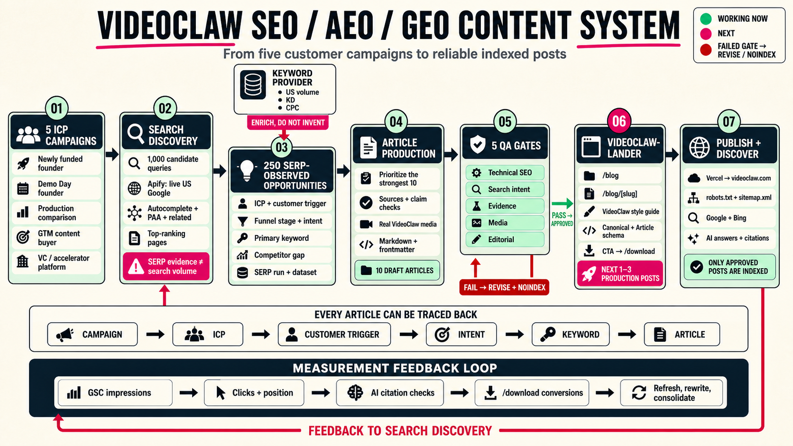

# VideoClaw SEO / AEO / GEO content system



## How to read the diagram

The main lane runs from left to right:

1. Define five precise customer campaigns.
2. Generate candidate searches and observe live US Google results with Apify.
3. Retain traceable opportunities with the ICP, customer trigger, funnel stage, intent, keyword, competitor gap, and SERP provenance attached.
4. Prioritize opportunities and produce source-backed Markdown articles with real VideoClaw media.
5. Require technical SEO, search-intent, evidence, media, and editorial QA. Failed records return for revision and remain `noindex`.
6. Render approved Markdown inside the production `videoclaw-lander` repository using the VideoClaw style guide.
7. Publish approved pages on `videoclaw.com`, expose them through `robots.txt` and `sitemap.xml`, and route readers to `/download`.

The keyword-provider input is deliberately separate from live SERP evidence. Apify proves what appears in US search results; an authenticated keyword provider supplies proprietary volume, keyword-difficulty, and CPC metrics. Those metrics must be enriched from the provider and never inferred from SERP observations.

## Current checkpoint

- 1,000 candidate searches have been generated across five campaigns.
- 250 opportunities have live US first-page SERP observations.
- Ten Demo Day articles exist as source-backed Markdown drafts.
- The article schema, traceability model, QA system, review renderer, and private deployment are working.
- The next production milestone is one to three manually approved posts integrated into `videoclaw-lander` and indexed on `videoclaw.com`.

## Traceability contract

Every published article must be reversible through this chain:

```text
Article ← keyword ← intent ← customer trigger ← ICP ← campaign
```

## Measurement loop

After publication, Google Search Console impressions, clicks, average position, AI citation checks, and `/download` conversions feed back into search discovery. Those signals determine whether each page should be refreshed, rewritten, consolidated, or expanded.
